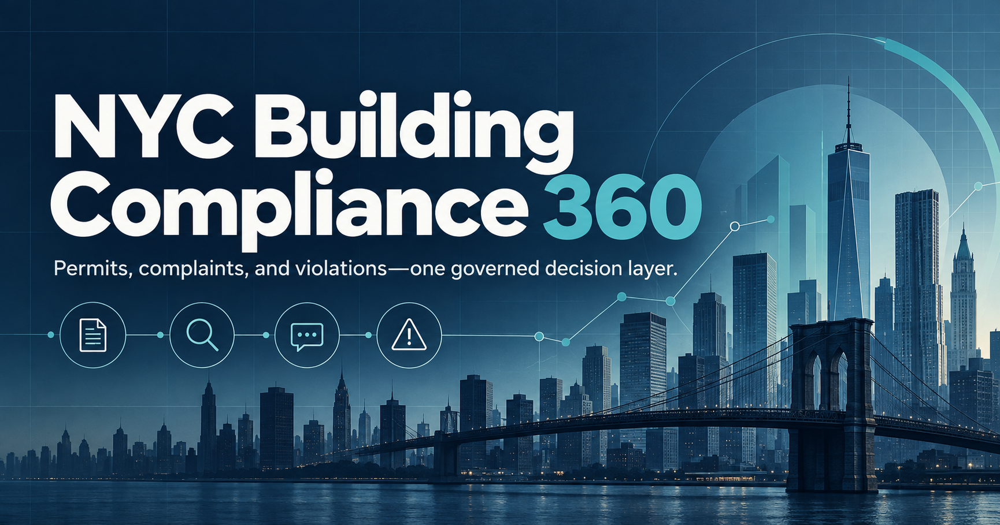

# NYC Building Compliance & Permit Analytics Platform

[](https://github.com/tom666d/nyc-building-compliance-analytics/actions/workflows/ci.yml)

A governed analytics platform that consolidates New York City permit, complaint, and violation
records into a building-level operations view. It gives compliance teams consistent metrics,
an explainable review queue, and traceable evidence from source API to dashboard.



## Business problem

Building compliance information is distributed across separate New York City Department of
Buildings datasets. Each source has its own identifiers, lifecycle statuses, dates, and quality
limitations. Answering a simple question such as *"Which buildings need attention first?"*
therefore requires manual reconciliation and leaves room for teams to calculate different answers.

This platform creates a shared analytical layer for four recurring decisions:

| User | Decision supported | Governed evidence |
|---|---|---|
| Compliance operations | Prioritize buildings for case review | Open complaints, open violations, item age, recent activity |
| Property management | Identify unresolved building workload | Building-level compliance summary and source coverage |
| Construction operations | Monitor permit lifecycle performance | Active permit records and approval-to-issue duration |
| Analytics teams | Publish consistent reporting | Tested definitions, lineage, freshness, and quality exceptions |

## Product outcome

**Building Compliance 360** turns three operational sources into a single decision product:

- a current building review queue with a transparent attention score;
- borough-level workload comparison;
- executive compliance and resolution metrics;
- building search by address, borough, or Building Identification Number; and
- visible source coverage, quality status, refresh date, and metric limitations.

The attention score ranks review workload; it is not a structural-safety prediction or legal risk
classification. This distinction keeps the output explainable and avoids claims the available
public data cannot support.

## Architecture

```text
Official NYC Open Data APIs
  permits | complaints | legacy violations
                  |
                  v
        Python ingestion service
     pagination | metadata | row hashes
                  |
                  v
            Snowflake RAW
                  |
                  v
       dbt staging and conformance
                  |
                  v
   dimensional facts + building dimension
                  |
                  v
      daily snapshot + quality audits
                  |
                  v
         governed consumption marts
                  |
                  v
       versioned dashboard contract
                  |
                  v
       Building Compliance 360

Apache Airflow orchestrates the warehouse path.
GitHub Actions validates code, model contracts, orchestration, and the dashboard on every change.
```

Metric logic is owned by dbt rather than duplicated in the dashboard. The web application consumes
a validated snapshot, so no Snowflake credential reaches the browser and page views do not resume
a warehouse.

## Technology stack

| Layer | Technology | Implementation |
|---|---|---|
| Source | NYC Open Data / Socrata APIs | Deterministic pagination over three official datasets |
| Ingestion | Python | Bounded loads, ingestion metadata, stable load IDs, row hashing, retry-safe merges |
| Warehouse | Snowflake | Role-separated raw, transformation, and consumption access with cost controls |
| Transformation | dbt Core | Staging, conformed dimensions, event facts, incremental snapshots, and marts |
| Data quality | dbt tests and audit models | Keys, relationships, status mappings, date logic, freshness, and coverage |
| Orchestration | Apache Airflow | Nine-task daily workflow with parallel ingestion, retries, and publication gates |
| Continuous integration | GitHub Actions | Python, dbt parsing, Airflow contract, dependency, data-contract, lint, and build checks |
| Consumption | Next.js and TypeScript | Responsive decision interface backed by a versioned JSON contract |

## Analytical model

| Model | Grain | Business purpose |
|---|---|---|
| `dim_buildings` | One validated Building Identification Number | Conformed building identity across sources |
| `fct_permit_records` | One distinct approved-permit source payload | Permit activity and lifecycle analysis |
| `fct_complaints` | One latest-state complaint | Complaint workload and resolution time |
| `fct_violations` | One latest-state legacy violation | Unresolved violation workload |
| `fct_building_compliance_daily` | One building per snapshot date | Historical, business-intelligence-ready foundation |
| `mart_building_compliance_current` | One building in the latest snapshot | Search, review queue, and attention score |
| `mart_borough_compliance_current` | One borough in the latest snapshot | Geographic workload comparison |
| `mart_compliance_overview` | One row in the latest snapshot | Executive key performance indicators |

Event facts are aggregated before they meet in the daily snapshot. This prevents a many-to-many
join across permits, complaints, and violations from multiplying business measures.

## Verified engineering evidence

The bounded validation run uses real records from three official New York City datasets; no
synthetic operational data is used.

| Evidence | Verified result |
|---|---:|
| Source records loaded | 1,000 permits + 1,000 complaints + 1,000 violations |
| Usable buildings in the published snapshot | 2,382 |
| Airflow workflow | 9 tasks completed |
| Full dbt build | 115 tests passed; 0 warnings; 0 errors |
| Consumption release | 3 marts built; 21 selected checks passed |
| Published metadata | 118 mart columns and 15 physical source columns documented |
| Continuous integration | Python, dbt, Airflow, dashboard contract, dependency audit, lint, and production build |

The checked-in dashboard snapshot is intentionally bounded and must not be interpreted as a
citywide estimate. Detailed execution evidence is recorded in
[orchestration](docs/orchestration.md), [data quality](docs/data_quality.md),
[lineage](docs/lineage.md), and [business intelligence consumption](docs/bi_consumption.md).

## Design decisions

Architecture decisions are recorded separately from implementation so reviewers can see the
trade-offs behind the code:

- [Use Building Identification Number as the canonical building key](docs/decisions/0002-building-identity.md)
- [Aggregate facts before creating the building snapshot](docs/decisions/0003-snapshot-not-wide-join.md)
- [Publish explicit status groups instead of inferring lifecycle state](docs/decisions/0006-explicit-status-groups.md)
- [Separate blocking data contracts from observable quality warnings](docs/decisions/0008-quality-severity-policy.md)
- [Orchestrate existing retry-safe commands](docs/decisions/0010-orchestrate-existing-commands-with-retry-safe-loads.md)
- [Publish a bounded, credential-free dashboard snapshot](docs/decisions/0012-publish-a-bounded-dashboard-snapshot.md)

One concrete result of this process was the discovery of the source placeholder `0000000`. It
matched the original seven-digit format check but is not a usable building identity. The revised
rule requires the first digit to be a valid borough code from one through five, and the invalid
records remain visible at event grain rather than being silently discarded.

## Operating the project

Run the same credential-free validation used by continuous integration:

```bash
make install
make ci-local
```

Run the decision interface locally:

```bash
make dashboard-install
make dashboard-check
make dashboard-dev
```

Warehouse execution requires a configured Snowflake account and least-privilege service identity.
The setup and runbooks are separated by operational responsibility:

- [Snowflake foundation and access](docs/snowflake_setup.md)
- [Source ingestion](docs/extraction.md)
- [Airflow orchestration](docs/orchestration.md)
- [Continuous integration boundaries](docs/continuous_integration.md)
- [Dashboard contract and deployment](docs/bi_consumption.md)

## Repository map

```text
src/                          Python ingestion and Snowflake loading
infrastructure/snowflake/     Warehouse objects, roles, and cost controls
dbt/nyc_building_compliance/  Transformations, tests, metadata, and exposures
airflow/dags/                 Scheduled workflow
dashboard/                    Next.js decision interface and data contract
scripts/                      Release and validation utilities
tests/                        Credential-free automated tests
docs/                         Product, architecture, runbooks, and decision records
```

## Scope and limitations

- The published snapshot contains 1,000 records from each source, not the full city population.
- The daily snapshot supports history, but only one published date currently exists; no trend is
  fabricated from a single observation.
- Legacy violations are modeled separately from newer DOB Safety Violations until a defensible
  cross-system deduplication rule is validated.
- Records without a usable building identifier remain in event facts and are excluded from
  building-level aggregates.
- The deployed dashboard is a static consumption artifact and refreshes only after a governed
  warehouse build and export.
- The corrected warehouse rebuild is pending the configured monthly Snowflake resource-monitor
  reset; the checked-in contract already excludes the discovered placeholder building.

See the [business brief](docs/business_brief.md), [official source inventory](docs/data_sources.md),
and [dimensional model](docs/data_model.md) for the complete metric and source boundaries.
