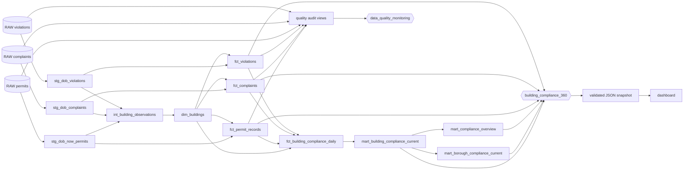

# Documentation and lineage

This project treats discoverability as a release contract, not as optional prose added
after implementation. A published mart is complete only when a reviewer can understand
its grain, columns, upstream sources, downstream consumers, quality rules, and known
limitations without reverse-engineering SQL.

## End-to-end lineage



The arrows represent declared `source()` and `ref()` dependencies rather than a manually
maintained drawing. dbt uses those references to create the executable Directed Acyclic
Graph and its generated lineage view.

## Published data products

| Product | Grain | Primary consumer | Downstream exposure |
|---|---|---|---|
| `dim_buildings` | One row per validated Building Identification Number | All building-level analysis | Indirectly both exposures |
| `fct_permit_records` | One row per distinct approved-permit source payload | Permit operations and drill-through | `building_compliance_360` |
| `fct_complaints` | One row per complaint using the latest ingested state | Complaint operations and drill-through | `building_compliance_360` |
| `fct_violations` | One row per latest legacy violation record | Compliance operations and drill-through | `building_compliance_360` |
| `fct_building_compliance_daily` | One row per building and snapshot date | Business intelligence summary | `building_compliance_360` |
| `mart_building_compliance_current` | One building in the latest snapshot | Review queue and drill-through | `building_compliance_360` |
| `mart_borough_compliance_current` | One borough in the latest snapshot | Workload comparison | `building_compliance_360` |
| `mart_compliance_overview` | One latest-snapshot overview | Executive metrics | `building_compliance_360` |
| Four `audit_*` views | One scorecard row per domain or one row per exception | Pipeline operators and analysts | `data_quality_monitoring` |

An exposure documents a use of the data beyond dbt. `building_compliance_360` now represents the
implemented business intelligence product and depends on the three dedicated consumption marts
plus drill-through facts. `data_quality_monitoring` makes the operational scorecard and
record-level investigation views visible as a separate consumer path. A deployment URL is added
only after the site is successfully published; no placeholder URL is used. The current dbt
exposure points to the owner-private
[deployed dashboard](https://nyc-building-compliance-360-portfolio.hsieh203.chatgpt.site).

## Documentation layers

### Resource and column descriptions

YAML files describe every physical column in the nine published marts and every physical
column in the three raw sources. Descriptions define meaning and limitations; tests define
machine-checkable behavior. A column may require both.

Reusable concepts such as `building_key`, source lineage fields, and audit record keys use
dbt docs blocks in `models/_docs.md`. The same file supplies a portfolio-specific
`__overview__` landing page.

### Generated artifacts

`make dbt-docs` asks dbt to introspect Snowflake and create generated documentation under
the ignored `target/` directory. The important artifacts are:

- `manifest.json`: project resources, descriptions, tests, dependencies, and exposures;
- `catalog.json`: warehouse relations, physical columns, types, and database comments;
- `index.html`: the local documentation website entry point.

Generated artifacts are evidence from a particular run, not source code. They remain out
of Git because they contain environment-specific metadata and can be recreated from the
tracked project plus Snowflake.

### Warehouse comments

The project enables `persist_docs` for relation and column descriptions. A dbt build writes
the same business definitions into Snowflake comments, so users who discover a mart in the
warehouse are not required to open this repository first. Source tables are documented in
dbt, but dbt does not apply `persist_docs` to declared sources.

## Documentation contract

The repository command below generates fresh artifacts and checks them against the
physical Snowflake catalog:

```text
make dbt-docs-check
```

`scripts/check_dbt_documentation.py` fails when:

1. a published mart is missing a model description;
2. any physical published column lacks a description;
3. documentation declares a column that no longer exists physically;
4. a raw source table or physical source column lacks a description;
5. an exposure lacks a description or owner;
6. exposure metadata contains a placeholder URL or contact value.

This closes a common gap: dbt can display an undocumented physical column after warehouse
introspection, so successful docs generation alone does not prove documentation coverage.

## Verified evidence

The first coverage audit found only 25 of 118 published physical columns documented. After
the Step 9 implementation, the live Snowflake-backed check reported:

```text
published models: 9
published columns: 118/118 documented
sources: 3
source columns: 15/15 documented
exposures: 2
Documentation contract passed.
```

The 2026-09-20 dbt build completed with 127 passing executable nodes, two exposure no-ops,
zero warnings, and zero errors. A regenerated Snowflake catalog confirmed that all nine
published relations had relation comments and all 118 published columns had column
comments.

On 2026-09-21, the selected consumption graph created three additional tables and passed 18 data
tests, for 21 passing executable nodes and one exposure no-op. The post-`0000000` normalization
rebuild remains pending the resource-monitor reset; that distinction is documented in the
dashboard rather than hidden.

## Using lineage for impact analysis

Before changing a model, inspect its downstream graph. For example, changing the permit
status mapping can affect:

```text
fct_permit_records
  -> fct_building_compliance_daily
  -> building_compliance_360
  -> quality audit views
  -> data_quality_monitoring
```

The graph identifies which products to rebuild and which stakeholders may see changed
results. It does not prove the change is correct; data tests, business review, and a clear
definition still provide that assurance.

## Commands

```text
make dbt-parse       # Validate project syntax and dependency references
make dbt-build       # Build models, run tests, and persist warehouse comments
make dbt-docs        # Generate the catalog and lineage site
make dbt-docs-check  # Generate docs and enforce documentation coverage
```

## Limitations and next steps

- Model-level lineage is generated from dbt dependencies. Full column-level lineage is not
  claimed by this dbt Core 1.12 implementation.
- The dashboard uses a versioned static snapshot. Lineage proves declared dependencies, not live
  synchronization between a page view and Snowflake.
- Coverage verifies that descriptions exist and match physical columns; human review must
  still judge whether the wording is accurate and useful.
- The current catalog represents the bounded portfolio sample and development schemas, not
  a production service-level agreement.
