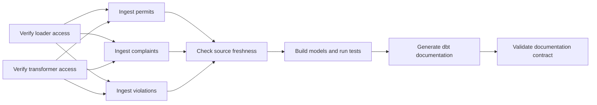

# Airflow orchestration

Apache Airflow coordinates the existing ingestion, transformation, quality, and
documentation commands. It does not contain source-specific transformations or business
metric logic. Those responsibilities remain in the Python package and dbt project, where
they can be tested and run independently.

## Daily workflow



The Dag is `nyc_dob_daily`. It is scheduled for 06:00 in the
`America/New_York` time zone and is paused when first registered. A human must therefore
review the configuration before it can consume Snowflake credits on a schedule.

| Stage | Purpose | Failure behavior |
|---|---|---|
| Access preflight | Confirm the least-privilege loader and transformer roles can see their required objects | No source is loaded if either role is not ready |
| Source ingestion | Read bounded records from three official NYC Open Data APIs and merge immutable raw payloads | The failed source retries; downstream tasks wait |
| Freshness gate | Compare raw ingestion timestamps with the declared dbt freshness policy | Stale data stops model publication |
| Build and test | Build the dbt graph and execute all data contracts | Any failing model or test stops documentation publication |
| Documentation | Regenerate the dbt manifest and physical Snowflake catalog | Missing or stale artifacts fail the task |
| Documentation contract | Compare authored metadata with physical warehouse columns | Undocumented published data cannot complete the Dag |

## Scheduling and execution controls

- Schedule: `0 6 * * *`, interpreted in `America/New_York`.
- Historical catch-up: disabled. Enabling a new local Dag does not automatically run every
  date since its start date.
- Maximum active Dag runs: one. Two daily runs cannot write and rebuild the same development
  schemas concurrently.
- Retries: two per task with a five-minute delay.
- Dag-run timeout: two hours.
- Task timeouts: five to forty-five minutes depending on the workload.
- Initial state: paused, which is a deliberate portfolio cost control.
- Default source limit: 1,000 rows per dataset per run, configurable through
  `AIRFLOW_NYC_DOB_INGEST_LIMIT`.

The three source tasks have no dependency on one another and can run in parallel under a
normal scheduler and executor. Airflow's local `dags test` command executes them in a
controlled test process and may run them sequentially.

## Retry-safe ingestion

Airflow can retry a task after a temporary API or database failure. A retry must not create
a second copy of rows already committed by the first attempt.

Every ingestion task receives Airflow's stable `run_id` as its `load_id`. The raw loader:

1. serializes each source row into canonical JSON;
2. calculates a SHA-256 `source_row_hash`;
3. removes duplicate payloads inside the fetched page;
4. merges rows into Snowflake in batches of 250;
5. inserts only when the pair `(source_row_hash, load_id)` does not already exist.

This guarantee is deliberately scoped to retries of the same Dag run. A new scheduled run
has a new `load_id`, so it preserves a new extraction snapshot even when a source row has
not changed. Staging models then select the appropriate latest business record. The raw
layer is therefore an auditable ingestion history, not a deduplicated business table.

The singular dbt test `assert_raw_load_retries_are_idempotent` independently checks all
three raw tables for duplicate retry keys. A controlled live check also loaded five permit
rows twice with the same `load_id`: the first command inserted five rows and the second
inserted zero.

## Environment and secret handling

Airflow is installed in `.airflow-venv`, separate from the project's `.venv`. Apache
Airflow publishes an official constraints file for a complete, mutually compatible
dependency set; isolating it prevents those constraints from changing dbt or ingestion
dependencies.

The Dag calls absolute paths inside the project environment. The checked-in definition
contains no password, private key, account token, or local credential path. Local test and
standalone commands inherit variables from the ignored `.env` file. A production deployment
should replace that local mechanism with an Airflow secrets backend or platform-managed
secret injection and use a production metadata database rather than SQLite.

## Local commands

```text
make install             # Install the ingestion and dbt project in editable mode
make airflow-install     # Create the isolated Airflow environment from constraints
make airflow-check       # Parse the Dag and validate its structural contract
make airflow-init        # Create or migrate the local metadata database
make airflow-test-dag    # Execute one complete controlled run against real services
make airflow-standalone  # Start the local scheduler, API server, and web interface
```

`make airflow-test-dag` changes Snowflake data and uses live NYC Open Data. It is an
integration test, not a static check. `make airflow-check` is the inexpensive default for
local development and future continuous integration.

## Verified evidence

The controlled run for logical date 2026-09-20 completed successfully with nine successful
task instances:

```text
2 access preflights
3 bounded source ingestion tasks (1,000 rows each)
1 source freshness gate (3/3 sources passed)
1 dbt build (PASS=128, WARN=0, ERROR=0, NO-OP=2, TOTAL=130)
1 documentation generation task
1 documentation contract (118/118 mart columns; 15/15 source columns)
```

The Dag structure check also confirmed nine expected tasks, a 06:00 New York schedule,
catch-up disabled, one maximum active run, two retries, task timeouts, and the paused initial
state.

## Known limitations

- The bounded extraction reads the first ordered source slice on every run. A production
  design still needs validated incremental watermarks and late-arriving-record handling.
- Local Airflow uses SQLite and the standalone executor. It is evidence of orchestration
  behavior, not a claim of a highly available production deployment.
- Failure notifications are not configured because no real recipient or incident channel
  exists for this portfolio project.
- New daily extraction snapshots intentionally repeat unchanged raw payloads under new load
  identifiers. Retention and full-volume storage costs need a production policy.
- The Dag is paused by default. Starting the local interface does not authorize recurring
  Snowflake spending until a user deliberately enables it.

## Official references

- [Apache Airflow quick start](https://airflow.apache.org/docs/apache-airflow/stable/start.html)
- [Dag concepts and Task Groups](https://airflow.apache.org/docs/apache-airflow/stable/core-concepts/dags.html)
- [Cron and time intervals](https://airflow.apache.org/docs/apache-airflow/stable/authoring-and-scheduling/cron.html)
- [Airflow best practices](https://airflow.apache.org/docs/apache-airflow/stable/best-practices.html)
- [Standard provider BashOperator](https://airflow.apache.org/docs/apache-airflow-providers-standard/stable/operators/bash.html)
- [Airflow command-line reference](https://airflow.apache.org/docs/apache-airflow/stable/cli-and-env-variables-ref.html)
